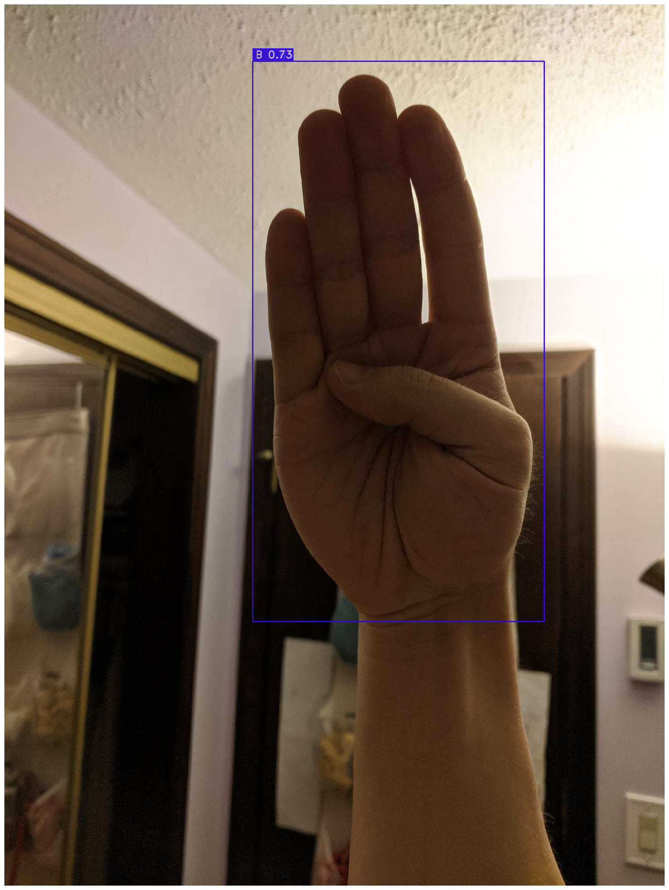

# Sign-language-recognition
The Sign Language Detection project using YOLO-NAS (You Only Look One - Neural Architecture Search)! This project focuses on utilizing the American Sign Language Letters Dataset to train an object detection model for recognizing sign language letters. The dataset is publicly accessible from Roboflow at [this link](https://public.roboflow.com/object-detection/american-sign-language-letters/1).

## Dataset
The dataset contains annotated images of American Sign Language (ASL) letters, providing a diverse set of examples for training a robust object detection model. It includes images with bounding box annotations around each sign language letter, making it suitable for YOLO (You Only Look Once) based models.

## YOLO
YOLO-NAS is an enhanced version of YOLO that incorporates Neural Architecture Search (NAS) to automatically discover optimal network architectures for the task at hand. This allows for more efficient and effective object detection, particularly in scenarios with unique requirements, such as sign language recognition.

## Result

